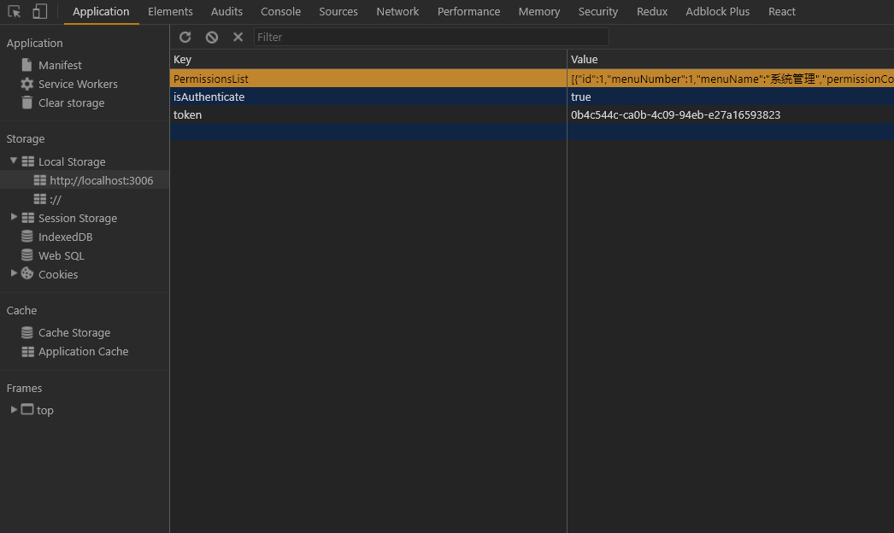
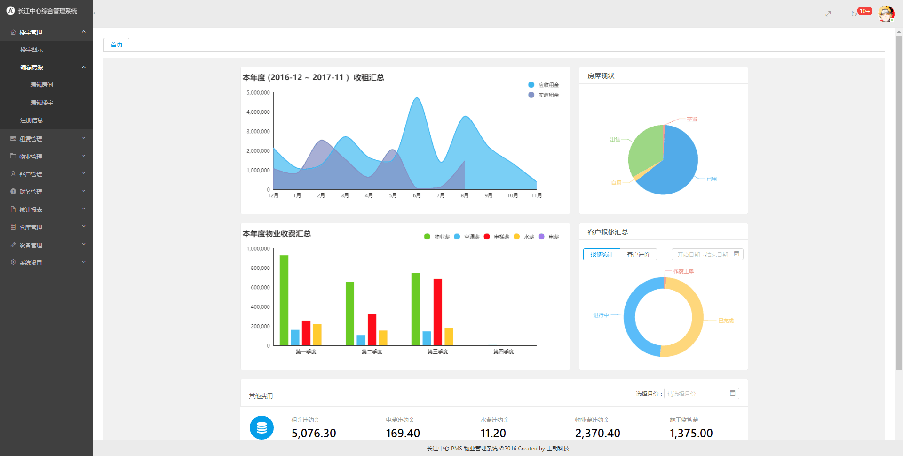
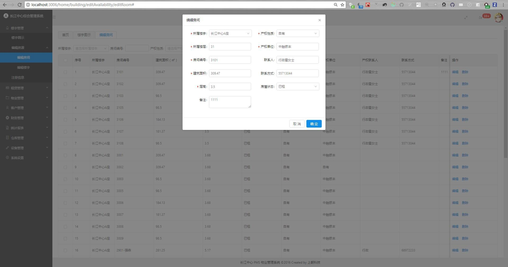
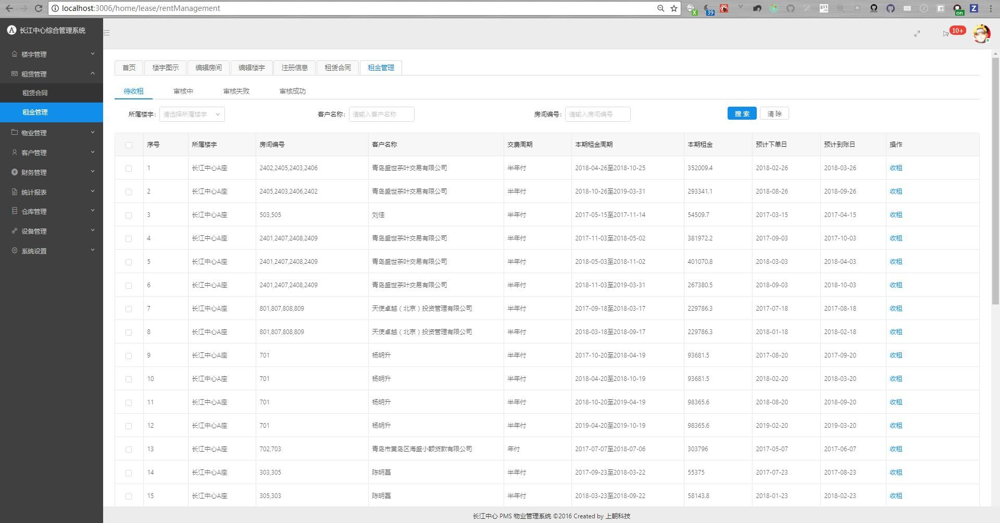
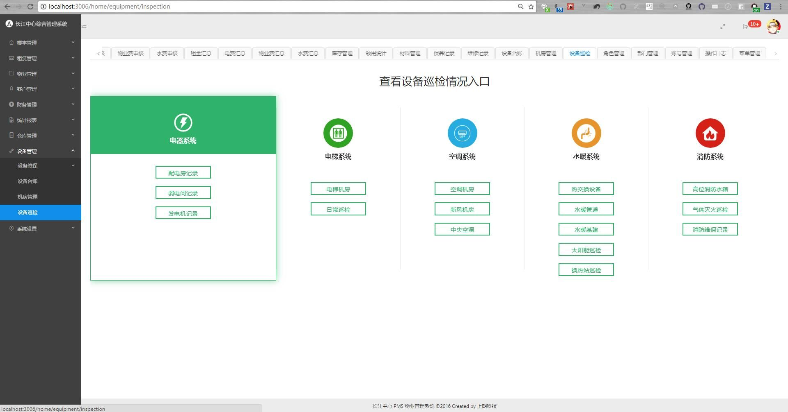
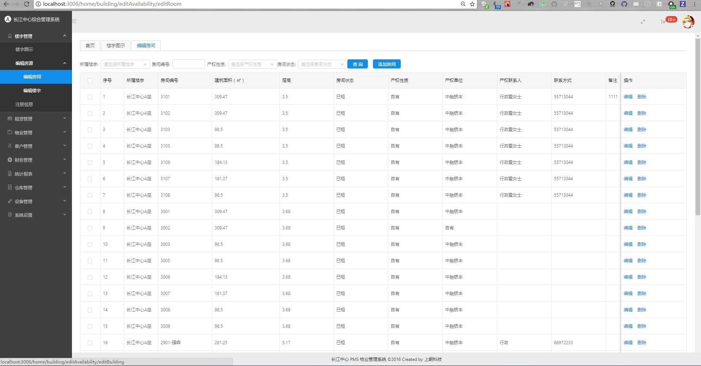
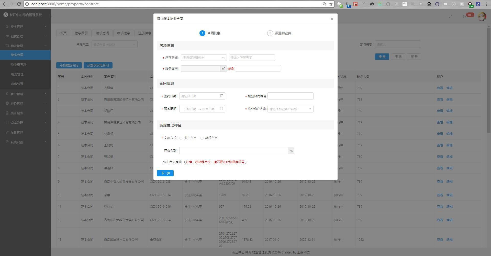

# 长江中心 - 物业管理系统 - V2.0版本

> 脚手架模型来自 [react-admin](https://github.com/yezihaohao/react-admin)
>
> *NPM* 版本请 升级到 `5.0.3` 以上
>
> *Nodejs* 版本 尽量使用 `7.9.0` 版本(可能在 node v8 版本有错误; 不推荐使用 v8以上)
>
> 开发环境, 请务必使用 *chrome* 作为调试浏览器; 并且安装 *react-devtools* 与 *redux-devtools* 调试插件;
>
> 因登录验证为 项目局域网内进行验证所以需要进行配置 Local Storage服务. [详细方法](#auth)

* [**React** v15.5.0更新说明 & v16.0.0更新预告](https://zhuanlan.zhihu.com/p/26250968)
* 使用 [ESlint](http://eslint.cn/) 进行代码检测
* 使用 [Redux](http://cn.redux.js.org/) 进行状态管理

## 使用技术:
| 全家桶                                                 | 作用                |  版本   |
| --------                                              | -----:              | :----:  |
| [react](https://facebook.github.io/react/)            | 视图库              | 15.6.1  |
| [redux](http://cn.redux.js.org/)                      | 状态管理             | 3.7.1  |
| [react-redux](http://cn.redux.js.org/docs/react-redux/index.html)                      | Redux的 React 绑定库             | 5.0.5  |
| [react-router](http://react-guide.github.io/react-router-cn/index.html)             | 路由管理            |  4.1.1 |
| [react-router-redux](https://github.com/ReactTraining/react-router/tree/master/packages/react-router-redux)       | 路由状态            |  5.0.0-alpha.6 |
| [react-router-config](https://github.com/ReactTraining/react-router/tree/master/packages/react-router-config)     | 静态路由配置            |  1.0.0-beta.3 |


| 开发依赖                                               | 作用                |  版本   |
| --------                                              | -----:              | :----:  |
| [ant-design](https://ant.design/index-cn)              | UI框架              | 2.10.4  |
| [axios](https://github.com/mzabriskie/axios)          | 交互处理            |  0.16.1  |
| [less](http://www.bootcss.com/p/lesscss/)             | 样式预处理器(AntD)  |  2.7.2  |
| [history](https://github.com/reacttraining/history)   | 路由历史  |  4.6.3  |
| [webpack](https://doc.webpack-china.org/)             | 模块打包            | 1.14.0  |
| [babel](http://babeljs.cn/)                           | ES6转译ES5          |  6.24.1  |
| [mockjs](http://mockjs.com/)                          | 模拟接口            |  1.0.1-beta3  |
| [Elf-ES]()                                            | ES版本Elf(管理样式) | 2.2.1 |
| [lodash](https://wizardforcel.gitbooks.io/lodash-doc-45/content/)   | 实用工具库  |  4.17.4  |
| [styled-components](https://www.styled-components.com/)   | CSS in JS实现方法  |  2.0.0  |
| [polished](https://polished.js.org/)   | JS风格的轻量样式工具集  |  1.1.3  |
| [store.js](https://github.com/marcuswestin/store.js)   | 操作local storage  |  2.0.12  |

## 使用插件:
| 插件名称                                                                     | 作用                                           |   版本  |
| --------                                                                     | -----:                                        | :-----: |
| [babel-plugin-import](https://github.com/ant-design/babel-plugin-import)     | AntD 加载组件模块                              | 1.2.1  |
| [echarts-for-react](https://github.com/hustcc/echarts-for-react)             | 基于React对echarts封装的可视化图表              | 1.4.1  |
| [nprogress](https://github.com/rstacruz/nprogress)                           | 顶部加载条                                     | 0.2.0  |
| [react-draft-wysiwyg](https://github.com/jpuri/react-draft-wysiwyg)          | ReactJS和DraftJS库构建的Wysiwyg编辑器          | 1.10.0  |
| [react-draggable](https://github.com/mzabriskie/react-draggable)             | 拖拽模块(简单版)                               | 2.2.6  |
| [react-quill](https://github.com/zenoamaro/react-quill)                      | React的 Quill组件(富文本)                      | 1.0.0-rc.2  |
| [recharts](https://github.com/recharts/recharts)                             | 另一个基于React封装的echarts图表(备用)          | 1.0.0-alpha.0  |
| [screenfull](https://github.com/sindresorhus/screenfull.js)                  | 全屏插件                                       | 3.2.0  |
| [animate.css](https://daneden.github.io/animate.css/)                        | CSS3 动画功能                                  | 3.5.2  |
| [qs](https://github.com/ljharb/qs)                                           | 字符串解析库(配合axios)                         | 6.4.0  |
| [moment](https://momentjs.com/)                                              | JS处理 / 操作 / 转换 时间日期                   | 2.18.1  |
| [hotcss](https://github.com/imochen/hotcss)                                  | 移动端布局终极解决方案                          | 2.2.1 |

# 目录结构
> 借鉴: [Redux + React 应用程序架构的 3 条规范（内附实例）](https://zhuanlan.zhihu.com/p/21490605)
>
> 借鉴: [React + Redux 最佳实践](https://github.com/sorrycc/blog/issues/1)
>
> 借鉴: [Redux状态管理之痛点、分析与改良](https://segmentfault.com/a/1190000009540007)

```bash
├── build /                         # 打包的文件目录
├── config /                        # webpack配置
├—— node_modules /                  # npm安装依赖目录
├── public /                        # 静态文件
│   ├── favicon.ico                 |   # 网页图标
│   ├── index.html                  |   # 入口 HTML文件
│   ├── npm.json                    |   # echarts测试数据
│   └── weibo.json                  |   # echarts测试数据
├── scripts /                       # webpack 配置文件
│   ├── build.js                    |   # webpack - '打包'配置
│   ├── start.js                    |   # webpack - '开发'配置
│   └── test.js                     |   # webpack - '测试'配置
├── src /                           # 开发目录
│   └── index.js                    |   # 项目的整体js入口文件, 配置插件
├── .babelrc                        # Babel 配置
├── .editorconfig                   # 统一编辑器配置
├── .env                            # 启动项目自定义端口配置文件
├── .eslintrc.js                    # ES( js / jsx ) 语法纠错
├── .eslintignore                   # 纠错忽略 配置
├── .gitignore                      # git忽略 配置
├── LICENSE                         # GPL3.0
├── package-lock.json               # NPM 依赖包 版本锁
├── package.json                    # 项目 配置
├── README.md                       # 项目 说明
├── .postcssrc.js                   # Postcss 配置
├── tsconfig.json                   # TypeScript 配置(已配置好 - 未使用)
├── tslint.json                     # TSlint(TS) 语法纠错(已配置好 - 未使用)
└── yarn.lock                       # Yarn 依赖包版本锁
```

***

# 说明: [`dev`开发模式 / 打包输出 的操作方法](./docs/打包输出&开发模式.md)

***

## 登录验证, Local Storage配置 方法

在 `chrome` 点击 `F12`, 在 调试台选择 `Application` 选项. 配置 `Key` 与 `Value`

```js
// key          :       value
isAuthenticate: true
token: 0b4c544c-ca0b-4c09-94eb-e27a16593823
PermissionsList: [{"id":1,"menuNumber":1,"menuName":"系统管理","permissionCode":"sys:view","menuType":1,"menuImg":"fa-cog","menuUrl":"","sort":10,"parentId":3,"delFlag":true,"createBy":null,"createDate":null,"updateBy":null,"updateDate":null},{"id":17,"menuNumber":2,"menuName":"角色管理","permissionCode":"user:view","menuType":2,"menuImg":"","menuUrl":"/sys/role","sort":1,"parentId":1,"delFlag":true,"createBy":null,"createDate":1487908425000,"updateBy":null,"updateDate":null},{"id":19,"menuNumber":3,"menuName":"角色修改","permissionCode":"role:up","menuType":3,"menuImg":"","menuUrl":"/role","sort":33,"parentId":17,"delFlag":true,"createBy":null,"createDate":1487995337000,"updateBy":null,"updateDate":null},{"id":20,"menuNumber":3,"menuName":"角色添加","permissionCode":"role:save","menuType":3,"menuImg":"","menuUrl":"222","sort":44,"parentId":17,"delFlag":true,"createBy":null,"createDate":1487995370000,"updateBy":null,"updateDate":null},{"id":21,"menuNumber":2,"menuName":"部门管理","permissionCode":"department:view","menuType":2,"menuImg":"","menuUrl":"/sys/department","sort":2,"parentId":1,"delFlag":true,"createBy":null,"createDate":1488176482000,"updateBy":null,"updateDate":null},{"id":22,"menuNumber":3,"menuName":"部门添加","permissionCode":"department:save","menuType":3,"menuImg":"","menuUrl":"","sort":1,"parentId":21,"delFlag":true,"createBy":null,"createDate":1488176542000,"updateBy":null,"updateDate":null},{"id":23,"menuNumber":3,"menuName":"部门编辑","permissionCode":"department:up","menuType":3,"menuImg":"","menuUrl":"","sort":2,"parentId":21,"delFlag":true,"createBy":null,"createDate":1488176566000,"updateBy":null,"updateDate":null},{"id":24,"menuNumber":2,"menuName":"登录账号","permissionCode":"user:view","menuType":2,"menuImg":"","menuUrl":"/sys/carousel","sort":3,"parentId":1,"delFlag":true,"createBy":null,"createDate":1488176740000,"updateBy":null,"updateDate":null},{"id":25,"menuNumber":3,"menuName":"账号添加","permissionCode":"user:save","menuType":3,"menuImg":"","menuUrl":"","sort":null,"parentId":24,"delFlag":true,"createBy":null,"createDate":1488176782000,"updateBy":null,"updateDate":null},{"id":26,"menuNumber":3,"menuName":"账号编辑","permissionCode":"user:up","menuType":3,"menuImg":"","menuUrl":"","sort":2,"parentId":24,"delFlag":true,"createBy":null,"createDate":1488176810000,"updateBy":null,"updateDate":null},{"id":27,"menuNumber":3,"menuName":"账号删除","permissionCode":"user:delete","menuType":3,"menuImg":"","menuUrl":"","sort":3,"parentId":24,"delFlag":true,"createBy":null,"createDate":1488176836000,"updateBy":null,"updateDate":null},{"id":28,"menuNumber":2,"menuName":"数据字典","permissionCode":"dict:view","menuType":2,"menuImg":"","menuUrl":"/sys/dict","sort":4,"parentId":1,"delFlag":true,"createBy":null,"createDate":1488176888000,"updateBy":null,"updateDate":null},{"id":29,"menuNumber":3,"menuName":"字典添加","permissionCode":"dict:save","menuType":3,"menuImg":"","menuUrl":"","sort":1,"parentId":28,"delFlag":true,"createBy":null,"createDate":1488176918000,"updateBy":null,"updateDate":null},{"id":30,"menuNumber":3,"menuName":"字典修改","permissionCode":"dict:up","menuType":3,"menuImg":"","menuUrl":"","sort":2,"parentId":28,"delFlag":true,"createBy":null,"createDate":1488176945000,"updateBy":null,"updateDate":null},{"id":31,"menuNumber":3,"menuName":"字典删除","permissionCode":"dict:delete","menuType":3,"menuImg":"","menuUrl":"","sort":3,"parentId":28,"delFlag":true,"createBy":null,"createDate":1488176973000,"updateBy":null,"updateDate":null},{"id":32,"menuNumber":2,"menuName":"操作日志","permissionCode":"log:view","menuType":2,"menuImg":"","menuUrl":"/sys/log","sort":5,"parentId":1,"delFlag":true,"createBy":null,"createDate":1488177014000,"updateBy":null,"updateDate":null},{"id":33,"menuNumber":2,"menuName":"菜单管理","permissionCode":"menu:view","menuType":2,"menuImg":"","menuUrl":"/sys/menu","sort":6,"parentId":1,"delFlag":true,"createBy":null,"createDate":1488177043000,"updateBy":null,"updateDate":null},{"id":34,"menuNumber":3,"menuName":"菜单添加","permissionCode":"menu:save","menuType":3,"menuImg":"","menuUrl":"","sort":1,"parentId":33,"delFlag":true,"createBy":null,"createDate":1488177069000,"updateBy":null,"updateDate":null},{"id":35,"menuNumber":3,"menuName":"菜单编辑","permissionCode":"menu:up","menuType":3,"menuImg":"","menuUrl":"","sort":2,"parentId":33,"delFlag":true,"createBy":null,"createDate":1488177101000,"updateBy":null,"updateDate":null},{"id":36,"menuNumber":3,"menuName":"菜单删除","permissionCode":"menu:delete","menuType":3,"menuImg":"","menuUrl":"","sort":3,"parentId":33,"delFlag":true,"createBy":null,"createDate":1488177135000,"updateBy":null,"updateDate":null},{"id":47,"menuNumber":1,"menuName":"财务管理","permissionCode":"finance:*","menuType":1,"menuImg":"fa-credit-card","menuUrl":"","sort":8,"parentId":3,"delFlag":true,"createBy":null,"createDate":1488243891000,"updateBy":null,"updateDate":null},{"id":48,"menuNumber":2,"menuName":"财务设置","permissionCode":"finace:view","menuType":2,"menuImg":"","menuUrl":"/sys/dict/finace","sort":15,"parentId":47,"delFlag":true,"createBy":null,"createDate":1488243938000,"updateBy":null,"updateDate":null},{"id":65,"menuNumber":3,"menuName":"水费审核","permissionCode":"shuifei","menuType":2,"menuImg":"","menuUrl":"/water/waterBillReviewed","sort":9,"parentId":47,"delFlag":true,"createBy":null,"createDate":1488619622000,"updateBy":null,"updateDate":null},{"id":165,"menuNumber":4,"menuName":"收款","permissionCode":"water:receivables","menuType":3,"menuImg":"","menuUrl":"","sort":1,"parentId":65,"delFlag":true,"createBy":null,"createDate":1494588564000,"updateBy":null,"updateDate":null},{"id":166,"menuNumber":4,"menuName":"开票","permissionCode":"water:billing","menuType":3,"menuImg":"","menuUrl":"","sort":2,"parentId":65,"delFlag":true,"createBy":null,"createDate":1494588631000,"updateBy":null,"updateDate":null},{"id":169,"menuNumber":4,"menuName":"违约金收款","permissionCode":"water:penaltyReceivables","menuType":3,"menuImg":"","menuUrl":"","sort":3,"parentId":65,"delFlag":true,"createBy":null,"createDate":1494589000000,"updateBy":null,"updateDate":null},{"id":170,"menuNumber":4,"menuName":"违约金开票","permissionCode":"water:penaltybilling","menuType":3,"menuImg":"","menuUrl":"","sort":4,"parentId":65,"delFlag":true,"createBy":null,"createDate":1494589058000,"updateBy":null,"updateDate":1494932357000},{"id":70,"menuNumber":2,"menuName":"租金审核","permissionCode":"rrrt","menuType":2,"menuImg":"","menuUrl":"collectRent/searchFinance","sort":1,"parentId":47,"delFlag":true,"createBy":null,"createDate":1488856006000,"updateBy":null,"updateDate":null},{"id":158,"menuNumber":3,"menuName":"租金收款","permissionCode":"collectRentPaid","menuType":3,"menuImg":"","menuUrl":"","sort":null,"parentId":70,"delFlag":true,"createBy":null,"createDate":1492161703000,"updateBy":null,"updateDate":null},{"id":174,"menuNumber":3,"menuName":"租金开票","permissionCode":"collectRentInvoice","menuType":3,"menuImg":"","menuUrl":"","sort":null,"parentId":70,"delFlag":true,"createBy":null,"createDate":1494812368000,"updateBy":null,"updateDate":1494932369000},{"id":175,"menuNumber":3,"menuName":"租金违约金收费","permissionCode":"collectRentLatePaid","menuType":3,"menuImg":"","menuUrl":"","sort":null,"parentId":70,"delFlag":true,"createBy":null,"createDate":1494812404000,"updateBy":null,"updateDate":1494932373000},{"id":176,"menuNumber":3,"menuName":"租金违约金开票","permissionCode":"collectRentLateInvoice","menuType":3,"menuImg":"","menuUrl":"","sort":null,"parentId":70,"delFlag":true,"createBy":null,"createDate":1494812433000,"updateBy":null,"updateDate":1494932376000},{"id":71,"menuNumber":2,"menuName":"租赁保证金审核","permissionCode":"fsgd","menuType":2,"menuImg":"","menuUrl":"/cashDeposit/cashDepositRentAudit","sort":11,"parentId":47,"delFlag":true,"createBy":null,"createDate":1488856387000,"updateBy":null,"updateDate":null},{"id":177,"menuNumber":3,"menuName":"租赁保证金财务审核","permissionCode":"cashDepositRentPaid","menuType":3,"menuImg":"","menuUrl":"","sort":null,"parentId":71,"delFlag":true,"createBy":null,"createDate":1494827547000,"updateBy":null,"updateDate":1494932380000},{"id":72,"menuNumber":2,"menuName":"能源管理押金审核","permissionCode":"rwer","menuType":2,"menuImg":"","menuUrl":"/cashDeposit/cashDepositPmAudit","sort":12,"parentId":47,"delFlag":true,"createBy":null,"createDate":1488856448000,"updateBy":null,"updateDate":null},{"id":178,"menuNumber":3,"menuName":"物业保证金财务审核","permissionCode":"cashDepositPmPaid","menuType":3,"menuImg":"","menuUrl":"","sort":null,"parentId":72,"delFlag":true,"createBy":null,"createDate":1494827593000,"updateBy":null,"updateDate":1494932384000},{"id":80,"menuNumber":2,"menuName":"物业费审核","permissionCode":"sss","menuType":2,"menuImg":"","menuUrl":"/propertyFee/searchFinance","sort":5,"parentId":47,"delFlag":true,"createBy":null,"createDate":1488884502000,"updateBy":null,"updateDate":null},{"id":131,"menuNumber":3,"menuName":"物业费作废","permissionCode":"cancellation","menuType":3,"menuImg":"","menuUrl":"","sort":null,"parentId":80,"delFlag":true,"createBy":null,"createDate":1491471907000,"updateBy":null,"updateDate":null},{"id":157,"menuNumber":3,"menuName":"物业收款","permissionCode":"propertyPaid","menuType":3,"menuImg":"","menuUrl":"","sort":null,"parentId":80,"delFlag":true,"createBy":null,"createDate":1492160516000,"updateBy":null,"updateDate":null},{"id":171,"menuNumber":3,"menuName":"物业费开票","permissionCode":"propertyInvoice","menuType":3,"menuImg":"","menuUrl":"","sort":null,"parentId":80,"delFlag":true,"createBy":null,"createDate":1494812098000,"updateBy":null,"updateDate":1494932353000},{"id":172,"menuNumber":3,"menuName":"物业费违约金收费","permissionCode":"propertyLatePaid","menuType":3,"menuImg":"","menuUrl":"","sort":null,"parentId":80,"delFlag":true,"createBy":null,"createDate":1494812194000,"updateBy":null,"updateDate":1494932362000},{"id":173,"menuNumber":3,"menuName":"物业费违约金开票","permissionCode":"propertyLateInvoice","menuType":3,"menuImg":"","menuUrl":"","sort":null,"parentId":80,"delFlag":true,"createBy":null,"createDate":1494812226000,"updateBy":null,"updateDate":1494932366000},{"id":84,"menuNumber":2,"menuName":"电费审核","permissionCode":"dfsh","menuType":2,"menuImg":"","menuUrl":"/electricityFees/electricityFeesExamine","sort":7,"parentId":47,"delFlag":true,"createBy":null,"createDate":1489814329000,"updateBy":null,"updateDate":null},{"id":163,"menuNumber":3,"menuName":"收费","permissionCode":"electricity:receivables","menuType":3,"menuImg":"","menuUrl":"","sort":1,"parentId":84,"delFlag":true,"createBy":null,"createDate":1494588448000,"updateBy":null,"updateDate":null},{"id":164,"menuNumber":3,"menuName":"开票","permissionCode":"electricity:billing","menuType":3,"menuImg":"","menuUrl":"","sort":2,"parentId":84,"delFlag":true,"createBy":null,"createDate":1494588502000,"updateBy":null,"updateDate":null},{"id":167,"menuNumber":3,"menuName":"违约金收款","permissionCode":"electricity:penaltyReceivables","menuType":3,"menuImg":"","menuUrl":"","sort":3,"parentId":84,"delFlag":true,"createBy":null,"createDate":1494588838000,"updateBy":null,"updateDate":null},{"id":168,"menuNumber":3,"menuName":"违约金开票","permissionCode":"electricity:penaltybilling","menuType":3,"menuImg":"","menuUrl":"","sort":4,"parentId":84,"delFlag":true,"createBy":null,"createDate":1494588930000,"updateBy":null,"updateDate":null},{"id":103,"menuNumber":2,"menuName":"二次装修审核","permissionCode":"fdfd","menuType":2,"menuImg":"","menuUrl":"secondDecorate/searchFinance","sort":10,"parentId":47,"delFlag":true,"createBy":null,"createDate":1490777730000,"updateBy":null,"updateDate":null},{"id":180,"menuNumber":3,"menuName":"二次装修财务审核","permissionCode":"secondDecoratePaid","menuType":3,"menuImg":"","menuUrl":"","sort":null,"parentId":103,"delFlag":true,"createBy":null,"createDate":1494902249000,"updateBy":null,"updateDate":1494932390000},{"id":181,"menuNumber":2,"menuName":"欢乐颂管理押金审核","permissionCode":"dddddddddd","menuType":2,"menuImg":"","menuUrl":"/cashDeposit/cashDepositSongAudit","sort":13,"parentId":47,"delFlag":true,"createBy":null,"createDate":1496775233000,"updateBy":null,"updateDate":null},{"id":182,"menuNumber":3,"menuName":"财务审核","permissionCode":"cashDepositSongPaid","menuType":3,"menuImg":"","menuUrl":"","sort":1,"parentId":181,"delFlag":true,"createBy":null,"createDate":1496775296000,"updateBy":null,"updateDate":null},{"id":50,"menuNumber":1,"menuName":"客户管理","permissionCode":"search:*","menuType":1,"menuImg":"fa-address-card-o","menuUrl":"","sort":5,"parentId":3,"delFlag":true,"createBy":null,"createDate":1488244379000,"updateBy":null,"updateDate":null},{"id":51,"menuNumber":2,"menuName":"客户资料","permissionCode":"customer:view","menuType":2,"menuImg":"","menuUrl":"/customer/search","sort":1,"parentId":50,"delFlag":true,"createBy":null,"createDate":1488244424000,"updateBy":null,"updateDate":null},{"id":136,"menuNumber":3,"menuName":"添加客户","permissionCode":"addCustomer","menuType":3,"menuImg":"","menuUrl":"","sort":1,"parentId":51,"delFlag":true,"createBy":null,"createDate":1492153302000,"updateBy":null,"updateDate":null},{"id":137,"menuNumber":3,"menuName":"修改客户","permissionCode":"editCustomer","menuType":3,"menuImg":"","menuUrl":"","sort":2,"parentId":51,"delFlag":true,"createBy":null,"createDate":1492153330000,"updateBy":null,"updateDate":null},{"id":154,"menuNumber":3,"menuName":"删除客户","permissionCode":"deleteCustomer","menuType":3,"menuImg":"","menuUrl":"","sort":3,"parentId":51,"delFlag":true,"createBy":null,"createDate":1492153425000,"updateBy":null,"updateDate":null},{"id":52,"menuNumber":2,"menuName":"合同管理","permissionCode":"rentContract:view","menuType":2,"menuImg":"","menuUrl":"/rentContract/search","sort":3,"parentId":50,"delFlag":true,"createBy":null,"createDate":1488244469000,"updateBy":null,"updateDate":null},{"id":104,"menuNumber":3,"menuName":"添加合同","permissionCode":"addContract","menuType":3,"menuImg":"","menuUrl":"","sort":null,"parentId":52,"delFlag":true,"createBy":null,"createDate":1490944019000,"updateBy":null,"updateDate":null},{"id":105,"menuNumber":3,"menuName":"修改合同","permissionCode":"enditContract","menuType":3,"menuImg":"","menuUrl":"","sort":null,"parentId":52,"delFlag":true,"createBy":null,"createDate":1490944203000,"updateBy":null,"updateDate":null},{"id":106,"menuNumber":3,"menuName":"编辑转租信息","permissionCode":"editSublet","menuType":3,"menuImg":"","menuUrl":"","sort":null,"parentId":52,"delFlag":true,"createBy":null,"createDate":1490944938000,"updateBy":null,"updateDate":null},{"id":107,"menuNumber":3,"menuName":"添加转租信息","permissionCode":"addSublet","menuType":3,"menuImg":"","menuUrl":"","sort":null,"parentId":52,"delFlag":true,"createBy":null,"createDate":1490945010000,"updateBy":null,"updateDate":null},{"id":108,"menuNumber":3,"menuName":"删除转租信息","permissionCode":"deleteSublet","menuType":3,"menuImg":"","menuUrl":"","sort":null,"parentId":52,"delFlag":true,"createBy":null,"createDate":1490945023000,"updateBy":null,"updateDate":null},{"id":109,"menuNumber":3,"menuName":"终止合同","permissionCode":"stopContract","menuType":3,"menuImg":"","menuUrl":"","sort":null,"parentId":52,"delFlag":true,"createBy":null,"createDate":1490945391000,"updateBy":null,"updateDate":null},{"id":183,"menuNumber":3,"menuName":"变更合同","permissionCode":"contractEditPm","menuType":3,"menuImg":"","menuUrl":"","sort":3,"parentId":52,"delFlag":true,"createBy":null,"createDate":1498029123000,"updateBy":null,"updateDate":1498057975000},{"id":53,"menuNumber":2,"menuName":"门禁卡管理","permissionCode":"elevatorCard:view","menuType":2,"menuImg":"","menuUrl":"/elevatorCard/search","sort":5,"parentId":50,"delFlag":true,"createBy":null,"createDate":1488244518000,"updateBy":null,"updateDate":null},{"id":110,"menuNumber":3,"menuName":"添加门禁卡","permissionCode":"addETcard","menuType":3,"menuImg":"","menuUrl":"","sort":null,"parentId":53,"delFlag":true,"createBy":null,"createDate":1490945583000,"updateBy":null,"updateDate":null},{"id":111,"menuNumber":3,"menuName":"修改门禁卡","permissionCode":"editETcard","menuType":3,"menuImg":"","menuUrl":"","sort":null,"parentId":53,"delFlag":true,"createBy":null,"createDate":1490945610000,"updateBy":null,"updateDate":null},{"id":112,"menuNumber":3,"menuName":"退门禁卡","permissionCode":"deleteETcard","menuType":3,"menuImg":"","menuUrl":"","sort":null,"parentId":53,"delFlag":true,"createBy":null,"createDate":1490945638000,"updateBy":null,"updateDate":null},{"id":54,"menuNumber":2,"menuName":"门禁卡押金","permissionCode":"elevatorCardDeposit:view","menuType":2,"menuImg":"","menuUrl":"/elevatorCardDeposit/search","sort":7,"parentId":50,"delFlag":true,"createBy":null,"createDate":1488244550000,"updateBy":null,"updateDate":null},{"id":73,"menuNumber":2,"menuName":"保证金管理","permissionCode":"cfsf","menuType":2,"menuImg":"","menuUrl":"/cashDeposit/searchCashDeposit","sort":9,"parentId":50,"delFlag":true,"createBy":null,"createDate":1488856510000,"updateBy":null,"updateDate":null},{"id":126,"menuNumber":3,"menuName":"保证金扣款","permissionCode":"chargeCashDeposit","menuType":1,"menuImg":"","menuUrl":"","sort":null,"parentId":73,"delFlag":true,"createBy":null,"createDate":1491471349000,"updateBy":null,"updateDate":null},{"id":127,"menuNumber":3,"menuName":"保证金退款","permissionCode":"refundCashDeposit","menuType":3,"menuImg":"","menuUrl":"","sort":null,"parentId":73,"delFlag":true,"createBy":null,"createDate":1491471483000,"updateBy":null,"updateDate":null},{"id":56,"menuNumber":1,"menuName":"收费管理","permissionCode":"charge:*","menuType":1,"menuImg":"fa-calendar-check-o","menuUrl":"","sort":1,"parentId":3,"delFlag":true,"createBy":null,"createDate":1488273034000,"updateBy":null,"updateDate":null},{"id":57,"menuNumber":2,"menuName":"抄表水费","permissionCode":"read:*","menuType":2,"menuImg":"","menuUrl":"/water/waterbill","sort":7,"parentId":56,"delFlag":true,"createBy":null,"createDate":1488273143000,"updateBy":null,"updateDate":null},{"id":58,"menuNumber":3,"menuName":"水费查询","permissionCode":"aterrates:view","menuType":2,"menuImg":"","menuUrl":"/water/waterFee","sort":1,"parentId":57,"delFlag":true,"createBy":null,"createDate":1488273237000,"updateBy":null,"updateDate":null},{"id":86,"menuNumber":4,"menuName":"审核中","permissionCode":"waterAudit","menuType":2,"menuImg":"","menuUrl":"","sort":2,"parentId":58,"delFlag":true,"createBy":null,"createDate":1490666823000,"updateBy":null,"updateDate":null},{"id":87,"menuNumber":4,"menuName":"审核失败","permissionCode":"waterAuditFailure","menuType":2,"menuImg":"","menuUrl":"","sort":3,"parentId":58,"delFlag":true,"createBy":null,"createDate":1490666858000,"updateBy":null,"updateDate":null},{"id":94,"menuNumber":5,"menuName":"重新发起","permissionCode":"waterLaunchtwo","menuType":3,"menuImg":"","menuUrl":"","sort":1,"parentId":87,"delFlag":true,"createBy":null,"createDate":1490765091000,"updateBy":null,"updateDate":null},{"id":88,"menuNumber":4,"menuName":"审核成功","permissionCode":"waterAuditSuccess","menuType":2,"menuImg":"","menuUrl":"","sort":4,"parentId":58,"delFlag":true,"createBy":null,"createDate":1490666896000,"updateBy":null,"updateDate":null},{"id":90,"menuNumber":4,"menuName":"待发起","permissionCode":"waterPendingLaunch","menuType":2,"menuImg":"","menuUrl":"","sort":1,"parentId":58,"delFlag":true,"createBy":null,"createDate":1490764690000,"updateBy":null,"updateDate":null},{"id":91,"menuNumber":5,"menuName":"添加电费","permissionCode":"addWater","menuType":3,"menuImg":"","menuUrl":"","sort":1,"parentId":90,"delFlag":true,"createBy":null,"createDate":1490764854000,"updateBy":null,"updateDate":null},{"id":92,"menuNumber":5,"menuName":"重新发起","permissionCode":"waterLaunch","menuType":3,"menuImg":"","menuUrl":"","sort":2,"parentId":90,"delFlag":true,"createBy":null,"createDate":1490764928000,"updateBy":null,"updateDate":null},{"id":93,"menuNumber":5,"menuName":"发起审核","permissionCode":"waterLaunchExamine","menuType":3,"menuImg":"","menuUrl":"","sort":4,"parentId":90,"delFlag":true,"createBy":null,"createDate":1490765012000,"updateBy":null,"updateDate":null},{"id":59,"menuNumber":3,"menuName":"水费记录","permissionCode":"water:ist:view","menuType":2,"menuImg":"","menuUrl":"/water/waterFeeList","sort":2,"parentId":57,"delFlag":true,"createBy":null,"createDate":1488273283000,"updateBy":null,"updateDate":null},{"id":74,"menuNumber":2,"menuName":"应收租金","permissionCode":"asfa","menuType":2,"menuImg":"","menuUrl":"/collectRent/search","sort":3,"parentId":56,"delFlag":true,"createBy":null,"createDate":1488856556000,"updateBy":null,"updateDate":null},{"id":75,"menuNumber":3,"menuName":"应收租金","permissionCode":"wer","menuType":2,"menuImg":"","menuUrl":"/collectRent/search","sort":1,"parentId":74,"delFlag":true,"createBy":null,"createDate":1488856600000,"updateBy":null,"updateDate":null},{"id":118,"menuNumber":4,"menuName":"收租","permissionCode":"openRentPaidWind","menuType":3,"menuImg":"","menuUrl":"","sort":null,"parentId":75,"delFlag":true,"createBy":null,"createDate":1491469374000,"updateBy":null,"updateDate":null},{"id":119,"menuNumber":4,"menuName":"重新收租","permissionCode":"openRentPaidWindAgain","menuType":3,"menuImg":"","menuUrl":"","sort":null,"parentId":75,"delFlag":true,"createBy":null,"createDate":1491469862000,"updateBy":null,"updateDate":null},{"id":76,"menuNumber":3,"menuName":"租金记录","permissionCode":"asdfas","menuType":2,"menuImg":"","menuUrl":"/collectRent/layout","sort":2,"parentId":74,"delFlag":true,"createBy":null,"createDate":1488856636000,"updateBy":null,"updateDate":null},{"id":77,"menuNumber":2,"menuName":"应收物业费","permissionCode":"propertyFee:view","menuType":2,"menuImg":"","menuUrl":"/propertyFee/search","sort":2,"parentId":56,"delFlag":true,"createBy":null,"createDate":1488863409000,"updateBy":null,"updateDate":null},{"id":78,"menuNumber":3,"menuName":"应收物业费","permissionCode":"/propertyFee/search","menuType":1,"menuImg":"","menuUrl":"/propertyFee/search","sort":1,"parentId":77,"delFlag":true,"createBy":null,"createDate":1488863836000,"updateBy":null,"updateDate":null},{"id":120,"menuNumber":4,"menuName":"收物业费","permissionCode":"openPropertyPaidWind","menuType":3,"menuImg":"","menuUrl":"","sort":null,"parentId":78,"delFlag":true,"createBy":null,"createDate":1491470109000,"updateBy":null,"updateDate":null},{"id":121,"menuNumber":4,"menuName":"重新收物业费","permissionCode":"openPropertyPaidWindAgain","menuType":3,"menuImg":"","menuUrl":"","sort":null,"parentId":78,"delFlag":true,"createBy":null,"createDate":1491470189000,"updateBy":null,"updateDate":null},{"id":132,"menuNumber":4,"menuName":"提交到财务审核","permissionCode":"updatePmPaid","menuType":3,"menuImg":"","menuUrl":"","sort":null,"parentId":78,"delFlag":true,"createBy":null,"createDate":1491804254000,"updateBy":null,"updateDate":null},{"id":179,"menuNumber":4,"menuName":"物业费删除","permissionCode":"deletePropertyFee","menuType":3,"menuImg":"","menuUrl":"","sort":null,"parentId":78,"delFlag":true,"createBy":null,"createDate":1494900296000,"updateBy":null,"updateDate":1494932388000},{"id":79,"menuNumber":3,"menuName":"物业费记录","permissionCode":"ass","menuType":1,"menuImg":"","menuUrl":"/propertyFee/layout","sort":2,"parentId":77,"delFlag":true,"createBy":null,"createDate":1488875972000,"updateBy":null,"updateDate":null},{"id":81,"menuNumber":2,"menuName":"抄表电费","permissionCode":"chaobiaodianfei","menuType":2,"menuImg":"","menuUrl":"/electricityFees/electricityFees","sort":5,"parentId":56,"delFlag":true,"createBy":null,"createDate":1489556498000,"updateBy":null,"updateDate":null},{"id":82,"menuNumber":3,"menuName":"电费查询","permissionCode":"dianfeichaxun","menuType":2,"menuImg":"","menuUrl":"/electricityFees/electricityFees","sort":1,"parentId":81,"delFlag":true,"createBy":null,"createDate":1489556555000,"updateBy":null,"updateDate":null},{"id":95,"menuNumber":4,"menuName":"待发起","permissionCode":"electricPendingLaunch","menuType":2,"menuImg":"","menuUrl":"","sort":1,"parentId":82,"delFlag":true,"createBy":null,"createDate":1490765348000,"updateBy":null,"updateDate":null},{"id":99,"menuNumber":5,"menuName":"添加电费","permissionCode":"addElectric","menuType":3,"menuImg":"","menuUrl":"","sort":1,"parentId":95,"delFlag":true,"createBy":null,"createDate":1490766234000,"updateBy":null,"updateDate":null},{"id":100,"menuNumber":5,"menuName":"重新发起","permissionCode":"electricLaunch","menuType":3,"menuImg":"","menuUrl":"","sort":3,"parentId":95,"delFlag":true,"createBy":null,"createDate":1490766302000,"updateBy":null,"updateDate":null},{"id":101,"menuNumber":5,"menuName":"发起审核","permissionCode":"electricExamine","menuType":3,"menuImg":"","menuUrl":"","sort":4,"parentId":95,"delFlag":true,"createBy":null,"createDate":1490766356000,"updateBy":null,"updateDate":null},{"id":96,"menuNumber":4,"menuName":"审核中","permissionCode":"electricAudit","menuType":2,"menuImg":"","menuUrl":"","sort":2,"parentId":82,"delFlag":true,"createBy":null,"createDate":1490765525000,"updateBy":null,"updateDate":null},{"id":97,"menuNumber":4,"menuName":"审核失败","permissionCode":"electricAuditFailure","menuType":2,"menuImg":"","menuUrl":"","sort":3,"parentId":82,"delFlag":true,"createBy":null,"createDate":1490766054000,"updateBy":null,"updateDate":null},{"id":102,"menuNumber":5,"menuName":"重新发起","permissionCode":"electricLaunchtwo","menuType":3,"menuImg":"","menuUrl":"","sort":1,"parentId":97,"delFlag":true,"createBy":null,"createDate":1490766386000,"updateBy":null,"updateDate":null},{"id":98,"menuNumber":4,"menuName":"审核成功","permissionCode":"electricAuditSuccess","menuType":2,"menuImg":"","menuUrl":"","sort":4,"parentId":82,"delFlag":true,"createBy":null,"createDate":1490766118000,"updateBy":null,"updateDate":null},{"id":83,"menuNumber":3,"menuName":"电费记录","permissionCode":"dfjl","menuType":2,"menuImg":"","menuUrl":"/electricityFees/electricityFeesAll","sort":2,"parentId":81,"delFlag":true,"createBy":null,"createDate":1489813420000,"updateBy":null,"updateDate":null},{"id":89,"menuNumber":2,"menuName":"二次装修","permissionCode":"rer","menuType":2,"menuImg":"","menuUrl":"/secondDecorate/search","sort":9,"parentId":56,"delFlag":true,"createBy":null,"createDate":1490755126000,"updateBy":null,"updateDate":null},{"id":128,"menuNumber":3,"menuName":"添加二次装修","permissionCode":"addSecondDecorate","menuType":3,"menuImg":"","menuUrl":"","sort":null,"parentId":89,"delFlag":true,"createBy":null,"createDate":1491471712000,"updateBy":null,"updateDate":null},{"id":129,"menuNumber":3,"menuName":"二次装修扣款","permissionCode":"chargeSecondDecorate","menuType":3,"menuImg":"","menuUrl":"","sort":null,"parentId":89,"delFlag":true,"createBy":null,"createDate":1491471804000,"updateBy":null,"updateDate":null},{"id":130,"menuNumber":3,"menuName":"二次装修退款","permissionCode":"refundSecondDecorate","menuType":3,"menuImg":"","menuUrl":"","sort":null,"parentId":89,"delFlag":true,"createBy":null,"createDate":1491471828000,"updateBy":null,"updateDate":null},{"id":66,"menuNumber":1,"menuName":"房产管理","permissionCode":"abc","menuType":1,"menuImg":"fa-bank","menuUrl":"","sort":3,"parentId":3,"delFlag":true,"createBy":null,"createDate":1488855477000,"updateBy":null,"updateDate":null},{"id":67,"menuNumber":2,"menuName":"楼宇管理","permissionCode":"www","menuType":2,"menuImg":"","menuUrl":"/building/search","sort":3,"parentId":66,"delFlag":true,"createBy":null,"createDate":1488855895000,"updateBy":null,"updateDate":null},{"id":134,"menuNumber":3,"menuName":"添加楼宇","permissionCode":"addBuild","menuType":3,"menuImg":"","menuUrl":"","sort":1,"parentId":67,"delFlag":true,"createBy":null,"createDate":1492152675000,"updateBy":null,"updateDate":null},{"id":135,"menuNumber":3,"menuName":"编辑楼宇","permissionCode":"editBuild","menuType":3,"menuImg":"","menuUrl":"","sort":2,"parentId":67,"delFlag":true,"createBy":null,"createDate":1492152780000,"updateBy":null,"updateDate":null},{"id":68,"menuNumber":2,"menuName":"房间管理","permissionCode":"rrr","menuType":2,"menuImg":"","menuUrl":"/room/layout","sort":1,"parentId":66,"delFlag":true,"createBy":null,"createDate":1488855936000,"updateBy":null,"updateDate":null},{"id":122,"menuNumber":3,"menuName":"房间添加","permissionCode":"addRoom","menuType":3,"menuImg":"","menuUrl":"","sort":null,"parentId":68,"delFlag":true,"createBy":null,"createDate":1491470306000,"updateBy":null,"updateDate":null},{"id":123,"menuNumber":3,"menuName":"房间编辑","permissionCode":"editRoom","menuType":3,"menuImg":"","menuUrl":"","sort":null,"parentId":68,"delFlag":true,"createBy":null,"createDate":1491470406000,"updateBy":null,"updateDate":null},{"id":156,"menuNumber":3,"menuName":"历史租户合同详情","permissionCode":"customerContractDetail","menuType":3,"menuImg":"","menuUrl":"","sort":null,"parentId":68,"delFlag":true,"createBy":null,"createDate":1492158557000,"updateBy":null,"updateDate":null},{"id":69,"menuNumber":2,"menuName":"注册公司","permissionCode":"ddd","menuType":2,"menuImg":"","menuUrl":"/company/layout","sort":7,"parentId":66,"delFlag":true,"createBy":null,"createDate":1488855965000,"updateBy":null,"updateDate":null},{"id":124,"menuNumber":3,"menuName":"公司编辑","permissionCode":"editCompany","menuType":3,"menuImg":"","menuUrl":"","sort":null,"parentId":69,"delFlag":true,"createBy":null,"createDate":1491470833000,"updateBy":null,"updateDate":null},{"id":125,"menuNumber":3,"menuName":"添加公司","permissionCode":"addCompany","menuType":3,"menuImg":"","menuUrl":"","sort":null,"parentId":69,"delFlag":true,"createBy":null,"createDate":1491470901000,"updateBy":null,"updateDate":null},{"id":162,"menuNumber":2,"menuName":"房间图示","permissionCode":"room:histogram","menuType":2,"menuImg":"","menuUrl":"/room/histogramAll","sort":5,"parentId":66,"delFlag":true,"createBy":null,"createDate":1493101522000,"updateBy":null,"updateDate":null},{"id":113,"menuNumber":1,"menuName":"统计报表","permissionCode":"statistical","menuType":1,"menuImg":"fa-bar-chart","menuUrl":"","sort":7,"parentId":3,"delFlag":true,"createBy":null,"createDate":1491372170000,"updateBy":null,"updateDate":null},{"id":114,"menuNumber":2,"menuName":"水费汇总","permissionCode":"water:form","menuType":2,"menuImg":"","menuUrl":"/water/waterBillList","sort":7,"parentId":113,"delFlag":true,"createBy":null,"createDate":1491372318000,"updateBy":null,"updateDate":null},{"id":115,"menuNumber":2,"menuName":"电费汇总","permissionCode":"electric:form","menuType":2,"menuImg":"","menuUrl":"/electricityFees/electricityFeesAll","sort":5,"parentId":113,"delFlag":true,"createBy":null,"createDate":1491373724000,"updateBy":null,"updateDate":null},{"id":116,"menuNumber":2,"menuName":"租金汇总","permissionCode":"fdf","menuType":2,"menuImg":"","menuUrl":"/collectRent/auditSuccessAll","sort":1,"parentId":113,"delFlag":true,"createBy":null,"createDate":1491445578000,"updateBy":null,"updateDate":null},{"id":117,"menuNumber":2,"menuName":"物业费汇总","permissionCode":"ggg","menuType":2,"menuImg":"","menuUrl":"/propertyFee/auditSuccessAll","sort":3,"parentId":113,"delFlag":true,"createBy":null,"createDate":1491445627000,"updateBy":null,"updateDate":null},{"id":205,"menuNumber":1,"menuName":"房源管理","permissionCode":"building","menuType":1,"menuImg":"","menuUrl":"/home/building","sort":null,"parentId":3,"delFlag":false,"createBy":null,"createDate":1504691348000,"updateBy":null,"updateDate":null},{"id":206,"menuNumber":2,"menuName":"楼宇图示","permissionCode":"buildingShow","menuType":2,"menuImg":"","menuUrl":"/home/building/buildingShow","sort":null,"parentId":205,"delFlag":false,"createBy":null,"createDate":1504691389000,"updateBy":null,"updateDate":null},{"id":207,"menuNumber":2,"menuName":"编辑房间","permissionCode":"editRoom","menuType":2,"menuImg":"","menuUrl":"/home/building/editAvailability/editRoom","sort":null,"parentId":205,"delFlag":false,"createBy":null,"createDate":1504691412000,"updateBy":null,"updateDate":null},{"id":208,"menuNumber":2,"menuName":"编辑楼宇","permissionCode":"editBuilding","menuType":2,"menuImg":"","menuUrl":"/home/building/editAvailability/editBuilding","sort":null,"parentId":205,"delFlag":false,"createBy":null,"createDate":1504691436000,"updateBy":null,"updateDate":null},{"id":209,"menuNumber":1,"menuName":"租赁管理","permissionCode":"lease","menuType":1,"menuImg":"","menuUrl":"/home/lease","sort":null,"parentId":3,"delFlag":false,"createBy":null,"createDate":1504691499000,"updateBy":null,"updateDate":null},{"id":210,"menuNumber":2,"menuName":"租赁合同","permissionCode":"leaseContract","menuType":2,"menuImg":"","menuUrl":"/home/lease/leaseContract","sort":null,"parentId":209,"delFlag":false,"createBy":null,"createDate":1504691524000,"updateBy":null,"updateDate":null},{"id":211,"menuNumber":2,"menuName":"租金管理","permissionCode":"rentManagement","menuType":2,"menuImg":"","menuUrl":"/home/lease/rentManagement","sort":null,"parentId":209,"delFlag":false,"createBy":null,"createDate":1504691545000,"updateBy":null,"updateDate":null},{"id":212,"menuNumber":2,"menuName":"注册信息","permissionCode":"registrationMessage","menuType":2,"menuImg":"","menuUrl":"/home/building/registrationMessage","sort":null,"parentId":209,"delFlag":false,"createBy":null,"createDate":1504691571000,"updateBy":null,"updateDate":null},{"id":213,"menuNumber":1,"menuName":"物业管理","permissionCode":"property","menuType":1,"menuImg":"","menuUrl":"/home/property","sort":null,"parentId":3,"delFlag":false,"createBy":null,"createDate":1504691812000,"updateBy":null,"updateDate":null},{"id":214,"menuNumber":2,"menuName":"物业合同","permissionCode":"contract","menuType":2,"menuImg":"","menuUrl":"/home/property/contract","sort":null,"parentId":213,"delFlag":false,"createBy":null,"createDate":1504691838000,"updateBy":null,"updateDate":null},{"id":215,"menuNumber":2,"menuName":"物业费管理","permissionCode":"propertyFee","menuType":2,"menuImg":"","menuUrl":"/home/property/propertyFee","sort":null,"parentId":213,"delFlag":false,"createBy":null,"createDate":1504691862000,"updateBy":null,"updateDate":null},{"id":216,"menuNumber":2,"menuName":"电费管理","permissionCode":"electricCharge","menuType":2,"menuImg":"","menuUrl":"/home/property/electricCharge","sort":null,"parentId":213,"delFlag":false,"createBy":null,"createDate":1504691884000,"updateBy":null,"updateDate":null},{"id":217,"menuNumber":2,"menuName":"水费管理","permissionCode":"waterCharge","menuType":2,"menuImg":"","menuUrl":"/home/property/waterCharge","sort":null,"parentId":213,"delFlag":false,"createBy":null,"createDate":1504691906000,"updateBy":null,"updateDate":null},{"id":218,"menuNumber":2,"menuName":"物业公告","permissionCode":"propertyNotice","menuType":2,"menuImg":"","menuUrl":"/home/client/propertyNotice","sort":null,"parentId":213,"delFlag":false,"createBy":null,"createDate":1504691930000,"updateBy":null,"updateDate":null},{"id":219,"menuNumber":1,"menuName":"客户管理","permissionCode":"client","menuType":1,"menuImg":"","menuUrl":"/home/client","sort":null,"parentId":3,"delFlag":false,"createBy":null,"createDate":1504691985000,"updateBy":null,"updateDate":null},{"id":220,"menuNumber":2,"menuName":"客户资料","permissionCode":"information","menuType":2,"menuImg":"","menuUrl":"/home/client/information","sort":null,"parentId":219,"delFlag":false,"createBy":null,"createDate":1504692010000,"updateBy":null,"updateDate":null},{"id":221,"menuNumber":2,"menuName":"客户报修","permissionCode":"repair","menuType":1,"menuImg":"","menuUrl":"/home/client/repair","sort":null,"parentId":219,"delFlag":false,"createBy":null,"createDate":1504692036000,"updateBy":null,"updateDate":null},{"id":227,"menuNumber":2,"menuName":"投诉建议","permissionCode":"complain","menuType":2,"menuImg":"","menuUrl":"/home/client/complain","sort":null,"parentId":219,"delFlag":false,"createBy":null,"createDate":1504747306000,"updateBy":null,"updateDate":null},{"id":228,"menuNumber":2,"menuName":"整改通知","permissionCode":"notice","menuType":2,"menuImg":"","menuUrl":"/home/client/notice","sort":null,"parentId":219,"delFlag":false,"createBy":null,"createDate":1504747328000,"updateBy":null,"updateDate":null},{"id":229,"menuNumber":2,"menuName":"二次装修","permissionCode":"secondaryDecoration","menuType":2,"menuImg":"","menuUrl":"/home/client/secondaryDecoration","sort":null,"parentId":219,"delFlag":false,"createBy":null,"createDate":1504747362000,"updateBy":null,"updateDate":null},{"id":222,"menuNumber":3,"menuName":"客户报修","permissionCode":"clientRepair","menuType":2,"menuImg":"","menuUrl":"/home/client/repair/clientRepair","sort":null,"parentId":221,"delFlag":false,"createBy":null,"createDate":1504692066000,"updateBy":null,"updateDate":null},{"id":225,"menuNumber":3,"menuName":"客户回访","permissionCode":"returnVisit","menuType":2,"menuImg":"","menuUrl":"/home/client/repair/returnVisit","sort":null,"parentId":221,"delFlag":false,"createBy":null,"createDate":1504692153000,"updateBy":null,"updateDate":null},{"id":226,"menuNumber":3,"menuName":"维修费设置","permissionCode":"maintenanceFees","menuType":2,"menuImg":"","menuUrl":"/home/client/repair/maintenanceFees","sort":null,"parentId":221,"delFlag":false,"createBy":null,"createDate":1504692186000,"updateBy":null,"updateDate":null},{"id":230,"menuNumber":2,"menuName":"保证金管理","permissionCode":"margin","menuType":2,"menuImg":"","menuUrl":"/home/client/margin","sort":null,"parentId":219,"delFlag":false,"createBy":null,"createDate":1504747385000,"updateBy":null,"updateDate":null},{"id":231,"menuNumber":2,"menuName":"门禁卡管理","permissionCode":"accessCard","menuType":1,"menuImg":"","menuUrl":"/home/client/accessCard","sort":null,"parentId":219,"delFlag":false,"createBy":null,"createDate":1504747417000,"updateBy":null,"updateDate":null},{"id":232,"menuNumber":3,"menuName":"门禁卡管理","permissionCode":"management","menuType":2,"menuImg":"","menuUrl":"/home/client/accessCard/management","sort":null,"parentId":231,"delFlag":false,"createBy":null,"createDate":1504747439000,"updateBy":null,"updateDate":null},{"id":233,"menuNumber":3,"menuName":"门禁卡押金","permissionCode":"deposit","menuType":2,"menuImg":"","menuUrl":"/home/client/accessCard/deposit","sort":null,"parentId":231,"delFlag":false,"createBy":null,"createDate":1504747467000,"updateBy":null,"updateDate":null},{"id":234,"menuNumber":2,"menuName":"房间梆定","permissionCode":"roombinding","menuType":2,"menuImg":"","menuUrl":"/home/client/roombinding","sort":null,"parentId":219,"delFlag":false,"createBy":null,"createDate":1504747498000,"updateBy":null,"updateDate":null},{"id":235,"menuNumber":1,"menuName":"财务管理","permissionCode":"finance","menuType":1,"menuImg":"","menuUrl":"/home/finance","sort":null,"parentId":3,"delFlag":false,"createBy":null,"createDate":1504747593000,"updateBy":null,"updateDate":null},{"id":236,"menuNumber":2,"menuName":"财务设置","permissionCode":"config","menuType":1,"menuImg":"","menuUrl":"/home/finance/config","sort":null,"parentId":235,"delFlag":false,"createBy":null,"createDate":1504747619000,"updateBy":null,"updateDate":null},{"id":239,"menuNumber":2,"menuName":"租金审核","permissionCode":"rentReview","menuType":2,"menuImg":"","menuUrl":"/home/finance/rentReview","sort":null,"parentId":235,"delFlag":false,"createBy":null,"createDate":1504747692000,"updateBy":null,"updateDate":null},{"id":240,"menuNumber":2,"menuName":"物业费审核","permissionCode":"propertyCostsReview","menuType":2,"menuImg":"","menuUrl":"/home/finance/propertyCostsReview","sort":null,"parentId":235,"delFlag":false,"createBy":null,"createDate":1504747716000,"updateBy":null,"updateDate":null},{"id":241,"menuNumber":2,"menuName":"电费审核","permissionCode":"electricity","menuType":2,"menuImg":"","menuUrl":"/home/finance/electricity","sort":null,"parentId":235,"delFlag":false,"createBy":null,"createDate":1504747739000,"updateBy":null,"updateDate":null},{"id":242,"menuNumber":2,"menuName":"水费审核","permissionCode":"waterFee","menuType":2,"menuImg":"","menuUrl":"/home/finance/waterFee","sort":null,"parentId":235,"delFlag":false,"createBy":null,"createDate":1504747767000,"updateBy":null,"updateDate":null},{"id":243,"menuNumber":2,"menuName":"租赁保证金审核","permissionCode":"leaseMargin","menuType":2,"menuImg":"","menuUrl":"/home/finance/leaseMargin","sort":null,"parentId":235,"delFlag":false,"createBy":null,"createDate":1504747789000,"updateBy":null,"updateDate":null},{"id":237,"menuNumber":3,"menuName":"收费设置","permissionCode":"toll","menuType":2,"menuImg":"","menuUrl":"/home/finance/config/toll","sort":null,"parentId":236,"delFlag":false,"createBy":null,"createDate":1504747642000,"updateBy":null,"updateDate":null},{"id":238,"menuNumber":3,"menuName":"开票信息","permissionCode":"billing","menuType":2,"menuImg":"","menuUrl":"/home/finance/config/billing","sort":null,"parentId":236,"delFlag":false,"createBy":null,"createDate":1504747662000,"updateBy":null,"updateDate":null},{"id":244,"menuNumber":2,"menuName":"欢乐颂押金审核","permissionCode":"happyDeposit","menuType":2,"menuImg":"","menuUrl":"/home/finance/happyDeposit","sort":null,"parentId":235,"delFlag":false,"createBy":null,"createDate":1504747812000,"updateBy":null,"updateDate":null},{"id":245,"menuNumber":2,"menuName":"能源管理押金审核","permissionCode":"energyDeposit","menuType":2,"menuImg":"","menuUrl":"/home/finance/energyDeposit","sort":null,"parentId":235,"delFlag":false,"createBy":null,"createDate":1504747835000,"updateBy":null,"updateDate":null},{"id":246,"menuNumber":2,"menuName":"二次装修审核","permissionCode":"secondReview","menuType":2,"menuImg":"","menuUrl":"/home/finance/secondReview","sort":null,"parentId":235,"delFlag":false,"createBy":null,"createDate":1504747862000,"updateBy":null,"updateDate":null},{"id":248,"menuNumber":2,"menuName":"租金汇总","permissionCode":"rent","menuType":2,"menuImg":"","menuUrl":"/home/statistics/rent","sort":null,"parentId":247,"delFlag":false,"createBy":null,"createDate":1504747951000,"updateBy":null,"updateDate":null},{"id":247,"menuNumber":1,"menuName":"统计报表","permissionCode":"statistics","menuType":1,"menuImg":"","menuUrl":"/home/statistics","sort":null,"parentId":3,"delFlag":false,"createBy":null,"createDate":1504747924000,"updateBy":null,"updateDate":null},{"id":249,"menuNumber":2,"menuName":"物业费汇总","permissionCode":"propertyCosts","menuType":2,"menuImg":"","menuUrl":"/home/statistics/propertyCosts","sort":null,"parentId":247,"delFlag":false,"createBy":null,"createDate":1504747973000,"updateBy":null,"updateDate":null},{"id":250,"menuNumber":2,"menuName":"电费汇总","permissionCode":"electricityBill","menuType":2,"menuImg":"","menuUrl":"/home/statistics/electricityBill","sort":null,"parentId":247,"delFlag":false,"createBy":null,"createDate":1504748004000,"updateBy":null,"updateDate":null},{"id":251,"menuNumber":2,"menuName":"水费汇总","permissionCode":"watchFee","menuType":2,"menuImg":"","menuUrl":"/home/statistics/watchFee","sort":null,"parentId":247,"delFlag":false,"createBy":null,"createDate":1504748027000,"updateBy":null,"updateDate":null},{"id":252,"menuNumber":1,"menuName":"仓库管理","permissionCode":"wareHouse","menuType":1,"menuImg":"","menuUrl":"/home/wareHouse","sort":null,"parentId":3,"delFlag":false,"createBy":null,"createDate":1504748176000,"updateBy":null,"updateDate":null},{"id":253,"menuNumber":2,"menuName":"库存管理","permissionCode":"inventoryManage","menuType":2,"menuImg":"","menuUrl":"/home/wareHouse/inventoryManage","sort":null,"parentId":252,"delFlag":false,"createBy":null,"createDate":1504748232000,"updateBy":null,"updateDate":null},{"id":254,"menuNumber":2,"menuName":"领用统计","permissionCode":"receiveStatistics","menuType":2,"menuImg":"","menuUrl":"/home/wareHouse/receiveStatistics","sort":null,"parentId":252,"delFlag":false,"createBy":null,"createDate":1504748253000,"updateBy":null,"updateDate":null},{"id":255,"menuNumber":2,"menuName":"材料管理","permissionCode":"meterialManagement","menuType":2,"menuImg":"","menuUrl":"/home/wareHouse/meterialManagement","sort":null,"parentId":252,"delFlag":false,"createBy":null,"createDate":1504748277000,"updateBy":null,"updateDate":null},{"id":256,"menuNumber":1,"menuName":"设备管理","permissionCode":"equipment","menuType":1,"menuImg":"","menuUrl":"/home/equipment","sort":null,"parentId":3,"delFlag":false,"createBy":null,"createDate":1504748353000,"updateBy":null,"updateDate":null},{"id":263,"menuNumber":1,"menuName":"系统设置","permissionCode":"system","menuType":1,"menuImg":"","menuUrl":"/home/system","sort":null,"parentId":3,"delFlag":false,"createBy":null,"createDate":1504748558000,"updateBy":null,"updateDate":null},{"id":269,"menuNumber":1,"menuName":"智能硬件","permissionCode":"hardware","menuType":1,"menuImg":"","menuUrl":"/home/hardware","sort":null,"parentId":3,"delFlag":false,"createBy":null,"createDate":1504748916000,"updateBy":null,"updateDate":null},{"id":257,"menuNumber":2,"menuName":"设备维保","permissionCode":"maintain","menuType":1,"menuImg":"","menuUrl":"/home/equipment/maintain","sort":null,"parentId":256,"delFlag":false,"createBy":null,"createDate":1504748384000,"updateBy":null,"updateDate":null},{"id":258,"menuNumber":3,"menuName":"保养记录","permissionCode":"maintenancePlan","menuType":2,"menuImg":"","menuUrl":"/home/equipment/maintain/maintenancePlan","sort":null,"parentId":257,"delFlag":false,"createBy":null,"createDate":1504748409000,"updateBy":null,"updateDate":null},{"id":259,"menuNumber":3,"menuName":"维修记录","permissionCode":"repairRecord","menuType":2,"menuImg":"","menuUrl":"/home/equipment/maintain/repairRecord","sort":null,"parentId":257,"delFlag":false,"createBy":null,"createDate":1504748437000,"updateBy":null,"updateDate":null},{"id":260,"menuNumber":2,"menuName":"设备台账","permissionCode":"equipmentAccount","menuType":2,"menuImg":"","menuUrl":"/home/equipment/equipmentAccount","sort":null,"parentId":256,"delFlag":false,"createBy":null,"createDate":1504748472000,"updateBy":null,"updateDate":null},{"id":261,"menuNumber":2,"menuName":"机房管理","permissionCode":"computerRoomManagement","menuType":2,"menuImg":"","menuUrl":"/home/equipment/computerRoomManagement","sort":null,"parentId":256,"delFlag":false,"createBy":null,"createDate":1504748493000,"updateBy":null,"updateDate":null},{"id":262,"menuNumber":2,"menuName":"设备巡检","permissionCode":"inspection","menuType":2,"menuImg":"","menuUrl":"/home/equipment/inspection","sort":null,"parentId":256,"delFlag":false,"createBy":null,"createDate":1504748517000,"updateBy":null,"updateDate":null},{"id":264,"menuNumber":2,"menuName":"角色管理","permissionCode":"role","menuType":2,"menuImg":"","menuUrl":"/home/system/role","sort":null,"parentId":263,"delFlag":false,"createBy":null,"createDate":1504748580000,"updateBy":null,"updateDate":null},{"id":265,"menuNumber":2,"menuName":"部门管理","permissionCode":"department","menuType":2,"menuImg":"","menuUrl":"/home/system/department","sort":null,"parentId":263,"delFlag":false,"createBy":null,"createDate":1504748605000,"updateBy":null,"updateDate":null},{"id":266,"menuNumber":2,"menuName":"账号管理","permissionCode":"account","menuType":2,"menuImg":"","menuUrl":"/home/system/account","sort":null,"parentId":263,"delFlag":false,"createBy":null,"createDate":1504748622000,"updateBy":null,"updateDate":null},{"id":267,"menuNumber":2,"menuName":"操作日志","permissionCode":"operationLog","menuType":2,"menuImg":"","menuUrl":"/home/system/operationLog","sort":null,"parentId":263,"delFlag":false,"createBy":null,"createDate":1504748642000,"updateBy":null,"updateDate":null},{"id":268,"menuNumber":2,"menuName":"菜单管理","permissionCode":"menu","menuType":2,"menuImg":"","menuUrl":"/home/system/menu","sort":null,"parentId":263,"delFlag":false,"createBy":null,"createDate":1504748663000,"updateBy":null,"updateDate":null},{"id":270,"menuNumber":2,"menuName":"空调监控","permissionCode":"airconditionermonitor","menuType":1,"menuImg":"","menuUrl":"/home/hardware/airconditionermonitor","sort":null,"parentId":269,"delFlag":false,"createBy":null,"createDate":1504748941000,"updateBy":null,"updateDate":null},{"id":271,"menuNumber":3,"menuName":"空调监控列表","permissionCode":"monitoringlist","menuType":2,"menuImg":"","menuUrl":"/home/hardware/airconditionermonitor/monitoringlist","sort":null,"parentId":270,"delFlag":false,"createBy":null,"createDate":1504748971000,"updateBy":null,"updateDate":null}]
```

### **配置如图**



***

# **项目效果（内网效果, 外网无数据）**









***

## **ToDoList**
- [ ] 关于: 首次运行 `yarn start` 开发模式, 只进入首页 无法登录的问题解决方案;(因 目前登录服务是在局域网内进行, 所以需要手动配置一下 localStore本地数据), 会尽快完善 这个测试功能;
- [ ] 在 `redux` 中使用 异步`thunk`
- [ ] 在 `redux` 中使用 [redux-saga](https://github.com/redux-saga/redux-saga); [中文文档](http://leonshi.com/redux-saga-in-chinese/)

