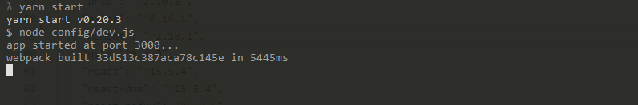
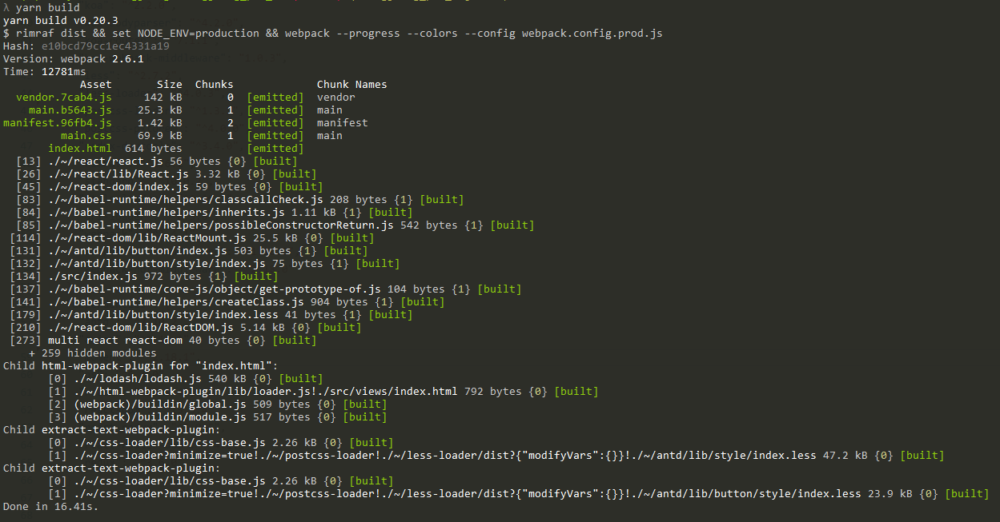
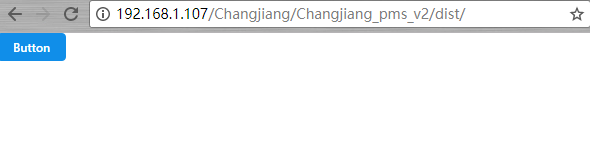

# 开发模式

在 命令行输入 

```bash
yarn start
````

就可以开启 支持`热加载`的开发模式



***

# 上线模式

在命令行输入
```bash
yarn build
```

可将文件整体打包输出



###  预览方式

> 需要开启服务器服务( 如`PHP`环境下的`Apache`服务 )


> 通过命令行查询当前ip地址( 如: `192.168.1.107` )

在浏览器内输入IP地址 + `dist`文件夹的相对路径, 即可查看打包后的页面



## 以上即为 测试 / 打包发版 的操作方法